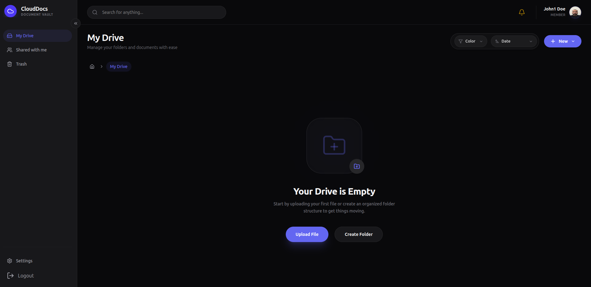
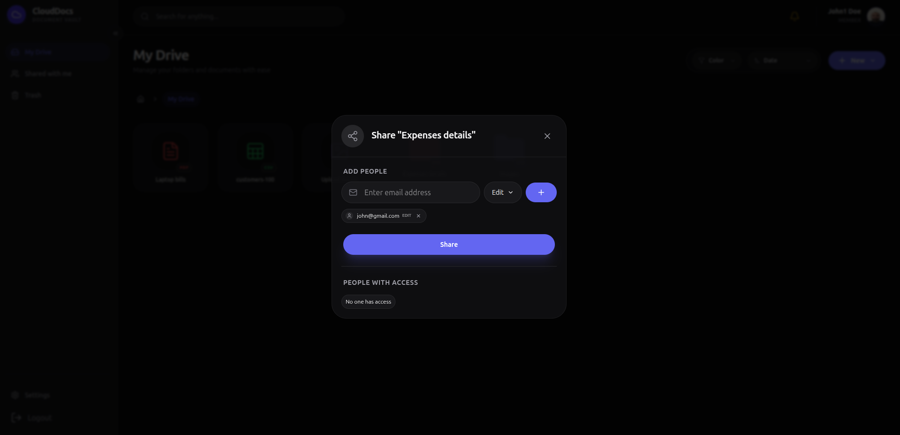

# Document Management System

A full-stack Document Management System (DMS) built with React.js, Node.js, and MongoDB. This system provides a robust platform for managing files and folders, facilitating seamless collaboration through document sharing, and tracking document-related activities. AI-powered document summarization and tagging.

## Features & Screenshots

- **Authentication System:** Secure user registration, login, and error handling.
- **Nested Folder Strategy:** Create folders within folders to organize documents efficiently.
- **File Upload & Management:** Upload multiple files with an intuitive UI and manage them seamlessly inside folders.
- **Document Actions & Sharing:** Share files with other users, view shared documents, and perform various actions like renaming or moving between folders.
- **Global Search & Filters:** Find your documents instantly across all folders using detailed search and advanced table filters.
- **Real-Time Activity Tracking:** Track modifications, uploads, and other activities related to your documents.
- **Trash Management:** Safely move items to trash and restore them if needed.

### Authentication
<div align="center">
  
  
  <br />
  
  
</div>

### Dashboard & File Organization
<div align="center">
  
  
  <br />
  
  
</div>

### File Uploading
<div align="center">
  
  
</div>

### Document Actions & Sharing
<div align="center">
  
  
  <br />
  
  
</div>

### Search, Filters & Trash
<div align="center">
  
  
  <br />
  
</div>

### AI Features
<div align="center">
  
</div>

## Technologies Used

**Frontend:**
- React 19 (Vite)
- Redux Toolkit (State Management)
- Tailwind CSS (Styling)
- Framer Motion (Animations)
- Socket.IO Client (Real-time events)

**Backend:**
- Node.js & Express.js
- MongoDB & Mongoose
- AWS S3 (File Storage)
- Redis & Socket.IO (Event broadcasting, real-time updates)
- JWT & bcryptjs (Authentication)

## Getting Started

### Prerequisites
- **Node.js**: v18.0.0 or higher
- **npm**: v9.0.0 or higher
- **MongoDB**: Local setup or MongoDB Atlas instance
- **Redis**: Local setup or remote cluster
- **AWS S3**: Active AWS account with an S3 Bucket provisioned

### Installation

1. **Clone the repository**
   ```bash
   git clone <repository-url>
   cd document-management-system
   ```

2. **Install dependencies for both client and server**
   ```bash
   npm run install:all
   ```
   *Note: If you prefer, you can install them separately using `npm run install:client` and `npm run install:server`.*

3. **Environment Setup**

   **Server:** Create a `.env` file in the `server` directory with the following variables:
   ```env
   PORT=5000
   NODE_ENV=development
   MONGODB_URI=your_mongodb_uri
   JWT_SECRET=your_jwt_secret
   AWS_ACCESS_KEY_ID=your_aws_access_key
   AWS_SECRET_ACCESS_KEY=your_aws_secret_key
   AWS_REGION=your_aws_region
   AWS_S3_BUCKET_NAME=your_bucket_name
   REDIS_URL=your_redis_url
   GEMINI_API_KEY=your_gemini_api_key
   ```

   **Client:** Ensure your client `.env` file (`client/.env`) is correctly configured:
   ```env
   VITE_API_BASE_URL=http://localhost:5000/api
   VITE_SOCKET_URL=http://localhost:5000
   ```

### Running the Application

You need to run both the client and server development setups concurrently. 

**Terminal 1 - Start Server:**
```bash
npm run server
```

**Terminal 2 - Start Client:**
```bash
npm run client
```

*The client will be running on `http://localhost:5173` and the server on `http://localhost:5000`.*

## License
ISC
